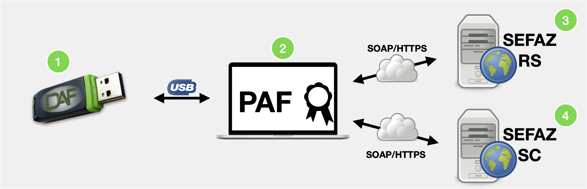

[](https://www.gnu.org/licenses/gpl-3.0)

> # Aviso de isenção de responsabilidade
>
>A presente prova de conceito (POC) é um artefato fruto do Contrato de Encomenda Tecnológica nº 001/2020, firmado entre a Secretaria de Estado da Fazenda de Santa Catarina e o Instituto Federal de Santa Catarina - IFSC.
>
>O objetivo desta prova de conceito é restrito aos objetivos contratados entre a SEF e o IFSC, compatível apenas com a versão 1.0.0 da especificação técnica de requisitos do DAF. Este artefato não tem como objetivo implementar completamente todos os processos de negócio previstos na especificação, visto que seu intuito foi demonstrar a viabilidade de implementação, tanto do DAF quanto da integração entre o PAF, DAF e a SEF-SC, utilizando tecnologias amplamente adotadas pelo mercado de desenvolvimento de software.
>
>Não cabe à SEF ou ao IFSC prestar suporte sobre os componentes, códigos ou excertos de código disponíveis nesta POC, sendo a presente versão considerada final, sem previsão de alterações, correção de bugs ou melhorias.
>
>A SEF e o IFSC eximem-se de qualquer responsabilidade, direta ou indireta, por perdas ou danos, comprovadamente ou alegadamente, causados pelos artefatos disponibilizados nesta POC. Caso deseje usar os componentes e softwares aqui disponibilizados, você estará fazendo isto exclusivamente por sua conta e risco.

# Dispositivo Autorizador Fiscal (DAF)

**Sumário**

  - [Introdução](#introdução)
  - [Kit de desenvolvimento MAX32552 EV KIT](#kit-de-desenvolvimento-max32552-ev-kit)
  - [Instalação da prova de conceito do DAF](#instalação-da-prova-de-conceito-do-daf)
    - [Requisitos de *Hardware*](#requisitos-de-hardware)
    - [Requisitos de *Software*](#requisitos-de-software)
    - [Instalação do DAF](#instalação-do-daf)
  - [Facilidades específicas da prova de conceito para ajudar no desenvolvimento do PAF](#facilidades-específicas-da-prova-de-conceito-para-ajudar-no-desenvolvimento-do-paf)
  - [Certificado da SEF e chave de ateste](#certificado-da-sef-e-chave-de-ateste)
  - [Limitações conhecidas](#limitações-conhecidas)
    - [Cifragem do artefato chave SEF](#cifragem-do-artefato-chave-sef)
    - [Certificado digital da SEF](#certificado-digital-da-sef)
  - [Dependências e bibliotecas de terceiros](#dependências-e-bibliotecas-de-terceiros)
## Introdução

Na [Especificação 1.0.0 do Dispositivo Autorizador Fiscal (DAF)](https://www.sef.sc.gov.br/arquivos_portal/servicos/136/DAF_Especificacao_de_Requisitos_1.0.0.pdf) são apresentados todos os casos de uso e protocolos que devem ser implementados pelo DAF para que o mesmo possa ser comandado pelo Programa Aplicativo Fiscal (PAF) para emissão de Nota Fiscal de Consumidor Eletrônica (NFC-e) em Santa Catarina.

Este repositório contém a prova de conceito do Dispositivo Autorizador Fiscal (DAF). Esta implementação contempla todos os casos de uso do DAF, bem como implementa o protocolo de comunicação especificado na [Especificação Técnica de Requisitos do DAF](https://www.sef.sc.gov.br/arquivos_portal/servicos/136/DAF_Especificacao_de_Requisitos_1.0.0.pdf) para fazer a interação com o Programa Aplicativo Fiscal (PAF). Um *kit* de desenvolvimento contendo uma implementação de um PAF, uma SEFAZ Autorizadora e uma SEF foi implementado para a validação desta prova de conceito. A figura abaixo apresenta as entidades que fazem parte do contexto do projeto do DAF, bem como a interação entre elas. 



1. **DAF** (este repositório)
    - Implementação em C++ de todos os casos de uso da [Especificação 1.0.0 do Dispositivo Autorizador Fiscal (DAF)](https://www.sef.sc.gov.br/arquivos_portal/servicos/136/DAF_Especificacao_de_Requisitos_1.0.0.pdf)
2. [**PAF** ](https://github.com/ifsc-lased/composicao-paf-sef)
   - O PAF do *kit* de desenvolvimento só implementa as rotinas cruciais para interação com o DAF, SEFAZ autorizadora e SEF. Trata-se assim de uma ferramenta de apoio que poderá ser usada por desenvolvedores de PAF e fabricantes de DAF.
3. [**SEFAZ Autorizadora**](https://github.com/ifsc-lased/composicao-paf-sef) 
   - A SEFAZ Autorizadora no *kit* de desenvolvimento tem como foco somente o caso de uso para autorização de uso de DF-e. A implementação consiste de uma simples rotina de persistência do DF-e autorizado para uso no banco de dados relacional usado pelo PAF. Sendo assim, não consiste de uma implementação real da SEFAZ autorizadora.
4. [**Secretaria de Estado da Fazenda de Santa Catarina (SEF)**](https://github.com/ifsc-lased/composicao-paf-sef) 
   - A SEF no *kit* de desenvolvimento provê implementação para os todos os casos de uso que envolvam diretamente o contribuinte e seu DAF, conforme apresentado na [Especificação 1.0.0 do Dispositivo Autorizador Fiscal (DAF)](https://www.sef.sc.gov.br/arquivos_portal/servicos/136/DAF_Especificacao_de_Requisitos_1.0.0.pdf). Por exemplo, registro de DAF, remoção de registro, autorização para remoção de autorização retida no DAF, entre outras.

> Disponibilizamos [aqui uma composição Docker](https://github.com/ifsc-lased/composicao-paf-sef) que permite facilmente montar um ambiente local de desenvolvimento composto pelas entidades PAF, SEFAZ autorizadora e SEF, apresentadas acima.

## Kit de desenvolvimento MAX32552 EV KIT
A implementação desta prova de conceito foi feita utilizando o *kit* de desenvolvimento **MAX32552 EV KIT**. Este *kit* de desenvolvimento contém o microcontrolador MAX 32552, um microcontrolador seguro que atende os requisitos de *hardware* especificados na [Especificação Técnica de Requisitos do DAF](https://www.sef.sc.gov.br/arquivos_portal/servicos/136/DAF_Especificacao_de_Requisitos_1.0.0.pdf). Dentre as características deste microcontrolador, estão:  

   * Sistema anti-violação
   * Memória segura
   * *True Random Number Generator* (TRNG)
   * Aceleradores criptográficos


## Instalação da prova de conceito do DAF
### Requisitos de *Hardware*

* *Kit* de desenvolvimento **MAX32552 EV KIT**

### Requisitos de *Software*

* IDE Eclipse modificada pela Maxim
   > SDK versão 3.7.0
  
* Biblioteca criptográfica da Maxim
   >  UCL 2.6.0

> O SDK e a biblioteca criptográfica são propriedade da Maxim e não são disponibilizados neste repositório. Entrar em contato com a fabricante para mais informações.
### Instalação do DAF

1. Clonar este repositório
   ```bash
   git clone https://github.com/ifsc-lased/daf-poc
   ```
2. Criar um novo projeto no Eclipse
   >  file -> New -> Project... -> C++ Managed Build
3. Selecionar o microcontrolador **MAX32552**
4. Clicar em `Next` até finalizar a criação do projeto
5. Substituir a pasta `src` que foi criada no projeto pela pasta [`src`](src) deste repositório
6. Substituir o arquivo `.cproject` que foi criado no projeto pelo o arquivo [`.cproject`](.cproject) deste repositório
7. Criar uma pasta no projeto chamada `lib` e adicionar a biblioteca criptográfica pré compilada disponibilizada pela Maxim
8. Criar uma pasta no projeto chamada `include` e adicionar os *headers* da biblioteca criptográfica disponibilizada pela Maxim 
9. Fazer o *build* do projeto
    > Project -> Build All
10. Transmitir o código ao *kit* de desenvolvimento
    > Run -> Run 

:clap: Pronto! O DAF da prova de conceito está instalado no *Kit* de desenvolvimento **MAX32552 EV KIT**. 

## Facilidades específicas da prova de conceito para ajudar no desenvolvimento do PAF

Nessa seção são apresentadas comandos específicos que o DAF da prova de conceito implementa para gerar facilidades para o desenvolvimento do PAF. O comando aqui apresentado não está de acordo com a [Especificação 1.0.0 do Dispositivo Autorizador Fiscal (DAF)](https://www.sef.sc.gov.br/arquivos_portal/servicos/136/DAF_Especificacao_de_Requisitos_1.0.0.pdf).

O DAF da prova de conceito pode a qualquer momento ser colocado no modo `padrão de fábrica`, estado no qual o dispositivo se comporta como um DAF recém adquirido. O [PAF](https://github.com/ifsc-lased/composicao-paf-sef) disponível no *kit* de desenvolvimento possui a funcionalidade para colocar o DAF no modo `padrão de fábrica`. Ao ser invocada, o PAF envia a mensagem com o código `9999` ao DAF

## Certificado da SEF e chave de ateste

De acordo com a [Especificação Técnica de Requisitos do DAF](https://www.sef.sc.gov.br/arquivos_portal/servicos/136/DAF_Especificacao_de_Requisitos_1.0.0.pdf), o DAF deverá conter o certificado digital da SEF. Por outro lado, a SEF já deverá ter a chave pública par da chave de ateste do DAF.

A especificação do DAF permite o uso de chaves criptográficas RSA ou EC. A chave de ateste do DAF da prova de conceito é uma chave EC P-384, enquanto que a chave pública contida no certificado da SEF também é uma chave EC P-384.

## Limitações conhecidas

### Cifragem do artefato chave SEF

A chave SEF deve ser transmitida ao DAF de forma cifrada, dentro de um *Token JWE*. No entanto, nesta implementação o DAF espera a chave SEF dentro do *Token JWE* em texto claro, codificada em Base64URL.

> O [PAF](https://github.com/ifsc-lased/composicao-paf-sef) disponível no *kit* de desenvolvimento transmite a chave SEF de forma cifrada conforme a [Especificação Técnica de Requisitos do DAF](https://www.sef.sc.gov.br/arquivos_portal/servicos/136/DAF_Especificacao_de_Requisitos_1.0.0.pdf)

### Certificado digital da SEF

Esta implementação não obtém a chave pública da SEF a partir do certificado da SEF. A chave pública par da chave privada que assina as mensagens da SEF foi armazenada de forma separada ao certificado e a mesma é obtida nos casos de uso necessários.


## Dependências e bibliotecas de terceiros

| Biblioteca |Função| Licença |
|------------|------|---------|
|[ArduinoJson](https://github.com/bblanchon/ArduinoJson) |Documentos JSON |[MIT License](https://github.com/bblanchon/ArduinoJson/blob/6.x/LICENSE.md)|